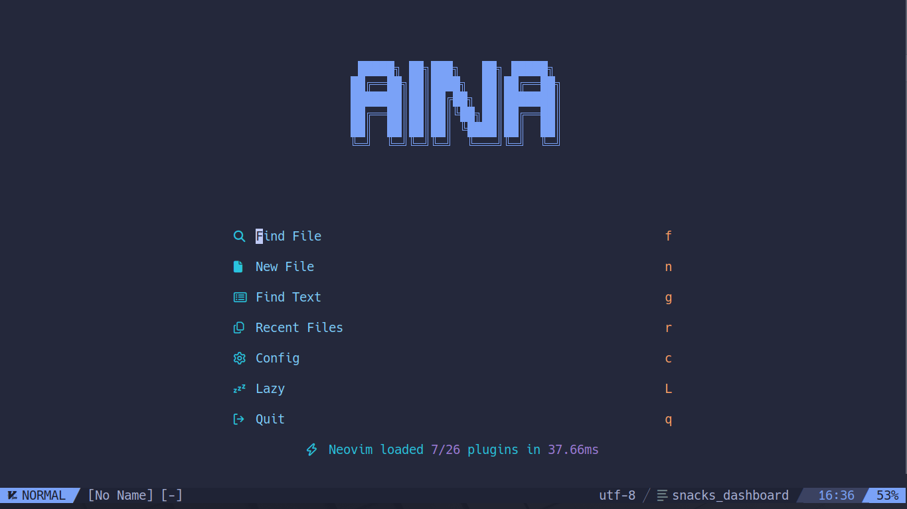

# dotfiles/nvim

<a href="https://dotfyle.com/AinaMatth/dotfiles-nvim"></a>
<a href="https://dotfyle.com/AinaMatth/dotfiles-nvim"></a>
<a href="https://dotfyle.com/AinaMatth/dotfiles-nvim"></a>


## Install Instructions

 > Install requires Neovim 0.9+. Always review the code before installing a configuration.

Clone the repository and install the plugins:

```sh
git clone git@github.com:AinaMatth/dotfiles ~/.config/AinaMatth/dotfiles
```

Open Neovim with this config:

```sh
NVIM_APPNAME=AinaMatth/dotfiles/nvim nvim
```

## Plugins

### colorscheme

+ [folke/tokyonight.nvim](https://dotfyle.com/plugins/folke/tokyonight.nvim)
### comment

+ [folke/todo-comments.nvim](https://dotfyle.com/plugins/folke/todo-comments.nvim)
### editing-support

+ [folke/snacks.nvim](https://dotfyle.com/plugins/folke/snacks.nvim)
+ [echasnovski/mini.pairs](https://dotfyle.com/plugins/echasnovski/mini.pairs)
### file-explorer

+ [stevearc/oil.nvim](https://dotfyle.com/plugins/stevearc/oil.nvim)
### formatting

+ [stevearc/conform.nvim](https://dotfyle.com/plugins/stevearc/conform.nvim)
### fuzzy-finder

+ [nvim-telescope/telescope.nvim](https://dotfyle.com/plugins/nvim-telescope/telescope.nvim)
### icon

+ [nvim-tree/nvim-web-devicons](https://dotfyle.com/plugins/nvim-tree/nvim-web-devicons)
+ [echasnovski/mini.icons](https://dotfyle.com/plugins/echasnovski/mini.icons)
### keybinding

+ [folke/which-key.nvim](https://dotfyle.com/plugins/folke/which-key.nvim)
### lsp

+ [j-hui/fidget.nvim](https://dotfyle.com/plugins/j-hui/fidget.nvim)
+ [neovim/nvim-lspconfig](https://dotfyle.com/plugins/neovim/nvim-lspconfig)
### lsp-installer

+ [williamboman/mason.nvim](https://dotfyle.com/plugins/williamboman/mason.nvim)
### nvim-dev

+ [folke/lazydev.nvim](https://dotfyle.com/plugins/folke/lazydev.nvim)
+ [nvim-lua/plenary.nvim](https://dotfyle.com/plugins/nvim-lua/plenary.nvim)
### plugin-manager

+ [folke/lazy.nvim](https://dotfyle.com/plugins/folke/lazy.nvim)
### snippet

+ [rafamadriz/friendly-snippets](https://dotfyle.com/plugins/rafamadriz/friendly-snippets)
### statusline

+ [nvim-lualine/lualine.nvim](https://dotfyle.com/plugins/nvim-lualine/lualine.nvim)
### syntax

+ [echasnovski/mini.surround](https://dotfyle.com/plugins/echasnovski/mini.surround)
+ [nvim-treesitter/nvim-treesitter](https://dotfyle.com/plugins/nvim-treesitter/nvim-treesitter)


